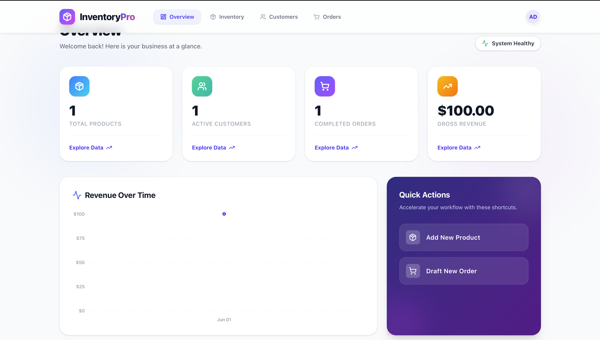
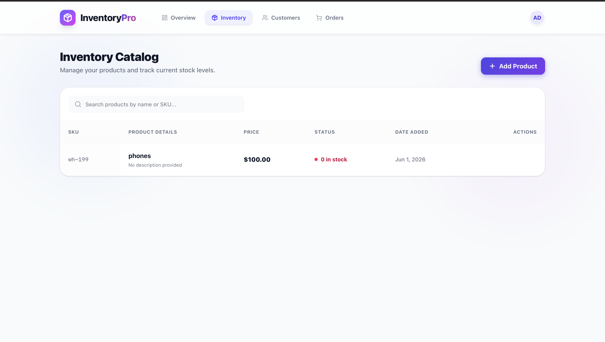
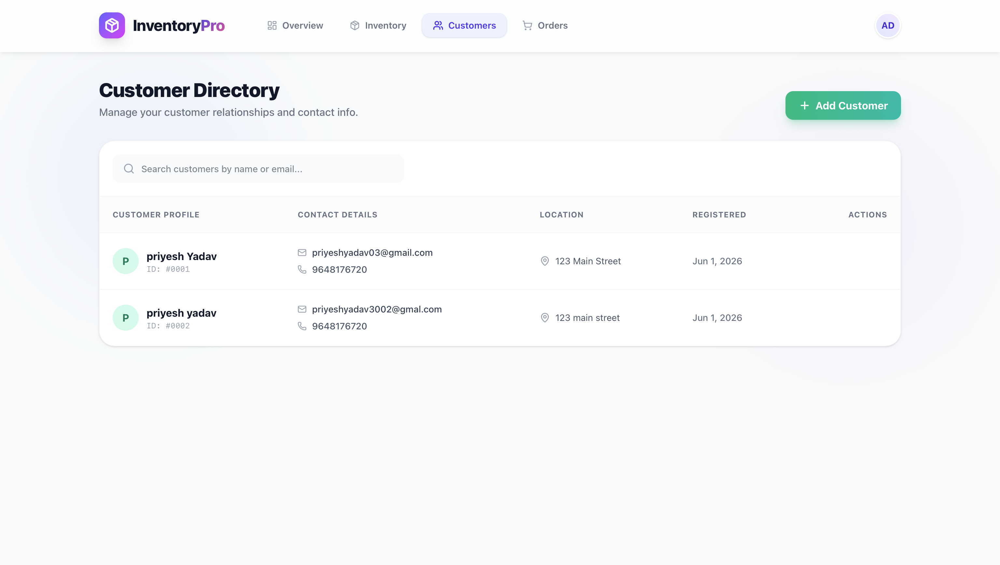
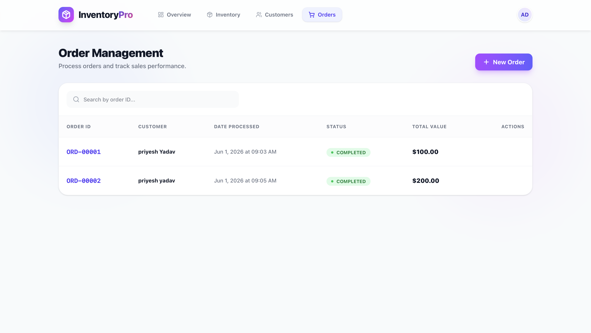

<div align="center">
  
# 📦 InventoryPro
### Advanced Inventory & Order Management System

[](https://inventory-management-system-627p.vercel.app)
[](https://inventory-management-system-iu4d.onrender.com)
[](https://hub.docker.com/r/priyesh390/inventory-backend)

*A full-stack, containerized solution designed to handle products, customers, and orders seamlessly.*

</div>

---

## 🚀 Live Links & Resources

- **Live Application (Frontend)**: [https://inventory-management-system-627p.vercel.app](https://inventory-management-system-627p.vercel.app)
- **Live API (Backend)**: [https://inventory-management-system-iu4d.onrender.com](https://inventory-management-system-iu4d.onrender.com)
- **GitHub Repository**: [priyeshyadav3002/Inventory-management-system](https://github.com/priyeshyadav3002/Inventory-management-system)
- **Docker Hub Images**: 
  - [priyesh390/inventory-backend](https://hub.docker.com/r/priyesh390/inventory-backend)
  - [priyesh390/inventory-frontend](https://hub.docker.com/r/priyesh390/inventory-frontend)

## 🛠️ Technology Stack

### Frontend (User Interface)
- **Framework**: React 18 & Vite
- **Styling**: Tailwind CSS (with Glassmorphism & Custom Animations)
- **Data Visualization**: Recharts for dynamic charts
- **Routing**: React Router DOM

### Backend (API & Business Logic)
- **Framework**: FastAPI (High-performance Python API framework)
- **ORM**: SQLAlchemy (Database management)
- **Data Validation**: Pydantic v2
- **Database**: PostgreSQL (Containerized)

### DevOps & Deployment
- **Containerization**: Docker & Docker Compose
- **Hosting**: Vercel (Frontend) and Render (Backend & PostgreSQL Database)

## ✨ Core Features & Business Rules

1. **Inventory Validation**: Orders cannot be processed if product stock is insufficient.
2. **Automatic Stock Reduction**: Creating a new order automatically deducts the exact purchased quantity from the product's available stock.
3. **Unique Constraints**: Strictly enforces unique SKUs for products and unique email addresses for customers.
4. **Interactive Dashboard**: Real-time calculated metrics for Gross Revenue, Total Products, Customers, and Completed Orders.
5. **Detailed Order Tracking**: View exact purchased items, timestamps, and customer relationships directly from the UI.

## 🐳 Running Locally with Docker

You can spin up the entire full-stack application instantly using Docker.

1. **Clone the repository**:
   ```bash
   git clone https://github.com/priyeshyadav3002/Inventory-management-system.git
   cd Inventory-management-system
   ```

2. **Start the application**:
   ```bash
   docker compose up --build -d
   ```

3. **Access the Application**:
   - **Frontend UI**: [http://localhost:3000](http://localhost:3000)
   - **Backend API Docs (Swagger UI)**: [http://localhost:8000/docs](http://localhost:8000/docs)
   - **PostgreSQL Database**: Accessible internally on port 5432.

*(To stop the application, run `docker compose down`)*

## 📸 Application Gallery

Here is a glimpse of the application interface:

| Overview Dashboard | Inventory Catalog |
|:---:|:---:|
|  |  |

| Customer Directory | Order Management |
|:---:|:---:|
|  |  |

---
*Developed as a candidate assessment project fulfilling all required instructions.*
